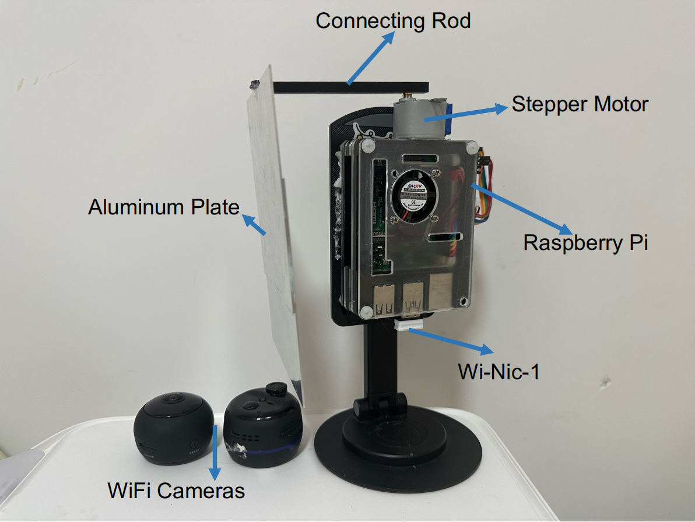

# DiffLoc: Hardware Implementation and Code

## Introduction

**DiffLoc** is a system designed to localize WiFi camera using a controlled diffraction approach. The system is built on a low-cost hardware platform using a Raspberry Pi, a stepper motor, and other off-the-shelf components.

---

## System Requirements

- **Hardware:**
  - Raspberry Pi 4B (any version with WiFi support)
  - USB WiFi Adapter (at least one can work on monitor mode)
  - Stepper Motor (ULN2003 control board and 5V 28BYJ-48 Stepper MotorStepper Motor)
  - 3D-printed connecting rod and stand
  - Aluminum metal plate (100X150X1 mm in our protype)
  - Power supply for the Raspberry Pi and external peripherals (Can use mobile power)
  
- **Software:**
  - Raspberry Pi OS (kernel 4.9 and firmware version 7_45_189 in our protype)
  - Python 3.7
  - Additional Python libraries (NumPy, sklearn, scipy, dpkt, tqdm and subprocess.)
---

## Hardware Setup

### Raspberry Pi Setup

1. **Raspberry Pi Preparation**:
    - Install Raspberry Pi OS (Raspberry Pi's default OS).
    - Ensure that WiFi is enabled and connected to the network.
    - Connect the Raspberry Pi to a display and keyboard for initial setup.
    - Install the necessary packages for CSI collection (using `nexmon` tool).

2. **WiFi Adapter**:
    - Attach the USB WiFi adapter (Wi-Nic-1) to the Raspberry Pi for communication with the target device.
    - Ensure that the another WiFi adapter (Wi-Nic-2) supports monitor mode to capture traffic.

### Step-by-Step Motor and Plate Setup

1. **Stepper Motor**:
    - Connect the stepper motor to the control board, ensuring that the wiring is correct for operation.
    - The motor should rotate the metal plate around the receiver (Raspberry Pi) to create the diffraction effect.
    - Test the motor's movement to confirm smooth rotation with no interruptions.

2. **3D Printed Components**:
    - Use a stand to position the motor and metal plate around the receiver.
    - Attach the thin metal plate to the stepper motor's rotating shaft.

---

## Software Setup
### Installing Dependencies
1. **Install Nexmon** (for CSI collection):
Follow the [Nexmon installation guide](https://github.com/seemoo-lab/nexmon_csi) to enable CSI extraction on the Raspberry Pi 4B.
3. **Clone the Repository**:
git clone this repository and cd DiffLoc

## Code Overview

### Main Components

1. **camsacn.py**: 
 - Detect hidde WiFi camera and send Mac address and channel to locationfu.py for localization.
 - Due to the difference in the RSSI values returned by the Raspberry Pi’s network card compared to standard methods, this code includes APs with readings of -39dBm or higher (as reported by the built-in Raspberry Pi network card) in the scanning range.

2. **locationfu.py**: 
 - Applies a stepper motor to rotate the metal plate, recording the corresponding path loss variations.
 - Processes the CSI data to estimate the target's azimuth angle using the diffraction-based localization model.

3. **ssetup.sh**:
 - Configure Nexmon csi tool.
4. **csitool**:
 - Tools for read and process nexmon csi data.

###  Running DiffLoc

 - Ensure all dependencies are installed
 - Use "airmon-ng start wlan 2" to make Wi-Nic-2 work on monitor mode.
 - Run camsacn.py for camera detection and localization, please leave romm according to the promot of the system. You can use a phone connect to DiffLoc with ssh.

---

## Demo

Demo please refer to demo.mp4 in this project. 

**Note: Playing the demo.mp4 or downloading the demo.mp4 file alone might not work due to a bug on the Anonymous GitHub website. In such cases, you need to download the entire repository to play the demo.**

---

## Contributing

We welcome contributions to improve and extend DiffLoc. If you would like to contribute, please fork the repository and submit a pull request. For larger contributions, please open an issue to discuss the changes before submitting.

---

## License

DiffLoc is released under the [MIT License](LICENSE). See the LICENSE file for more information.

---
